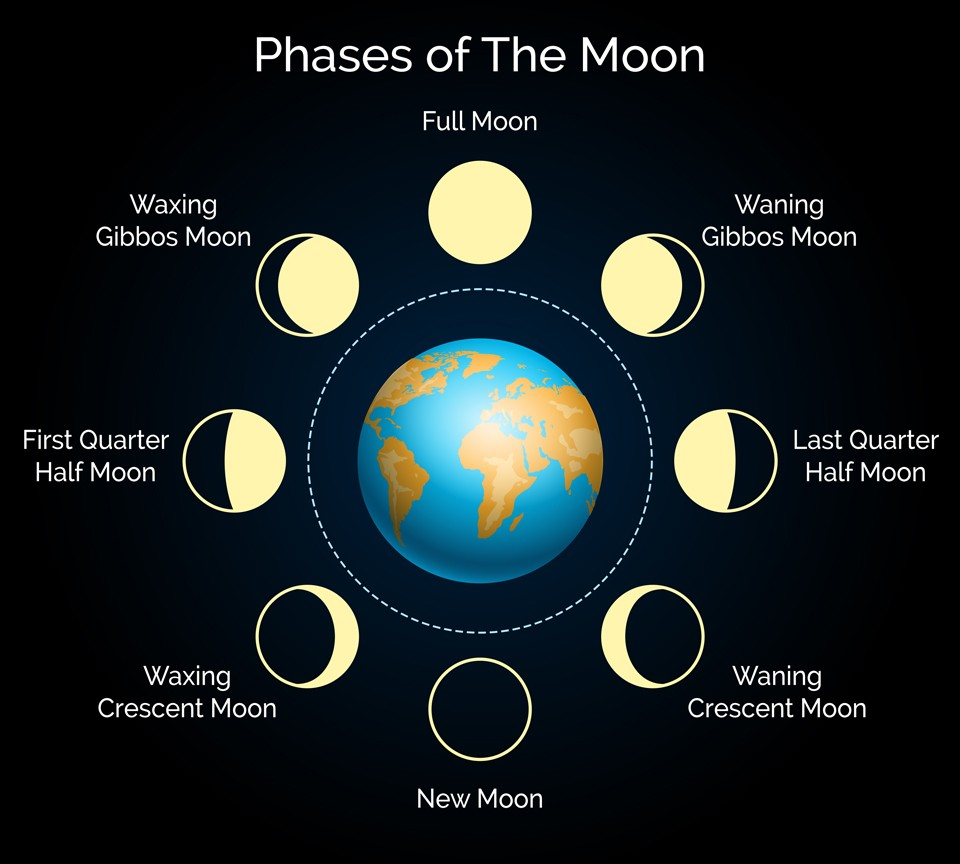

# Moon-Phase

[What are the Moon's Phases for?](https://www.bbc.co.uk/newsround/51047406) due to it's importance I have embarked on a journey to and for the Moon.

**Moon Phases**

**API Documentation**
* [Farmsense](https://www.farmsense.net/api/astro-widgets/)  
* [Unix Timestamp](https://unixtime.co.za/)

**p5js Documentation**
* [Parent Documentation](https://p5js.org/reference/#/p5.Element/parent)
* [httpDo](https://p5js.org/reference/#/p5/httpDo)
* [HttpGet](https://p5js.org/reference/#/p5/httpGet)
* [arc() Documentation](https://p5js.org/reference/#/p5/arc)

**Javascript Documentation**

[Different Methods for Creating Objects in JS](https://www.developerdrive.com/4-ways-to-create-an-object-in-javascript-with-examples/)
[Checking Object's Property](https://attacomsian.com/blog/javascript-object-check-if-property-exists)
[Access an Object's Methods fom a parameter value](https://stackoverflow.com/questions/9854995/javascript-dynamically-invoke-object-method-from-string)

